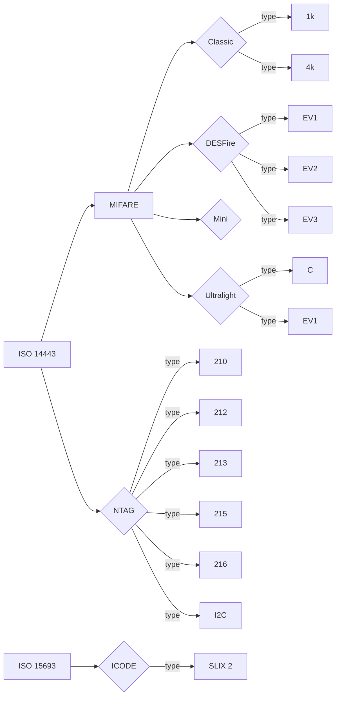

---
High Frequency aka 13.56 Mhz aka NFC
---

```mermaid
  flowchart LR;
    A[ISO 14443] --> A1 & A2;
    A1[MIFARE] --> A1.1{Classic} & A1.2{DESFire} & A1.3{Mini} & A1.4{Ultralight};
    A1.1 -- type --> A1.1a[1k] & A1.1b[4k];
    A1.2 -- type --> A1.2a[EV1] & A1.2b[EV2] & A1.2c[EV3];
    A1.4 -- type --> A1.4a[C] & A1.4b[EV1];
    A2{NTAG} -- type --> A2.1[210] & A2.2[212] & A2.3[213] & A2.4[215] & A2.5[216] & A2.6[I2C];
    B[ISO 15693] --> B1{ICODE};
    B1 -- type --> B1.1[SLIX 2];

```
