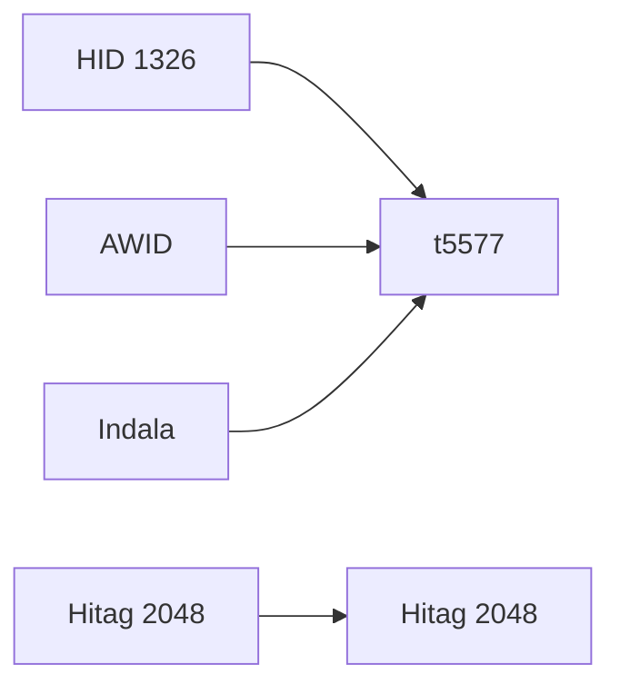

---
Low Frequency aka 125 kHz aka RFID
---

```mermaid
  flowchart LR;
      B1[t5577];
      A2[HID 1326] --> B1;
      A3[AWID] --> B1;
      A4[Indala] --> B1;
      AX[Hitag 2048] --> B2[Hitag 2048];

```

### Choosing an Implant:
- [t5577](T5577_OPTIONS.md)
- [Hitag 2048](https://dngr.us/xht)

---
### [Back to Identifying Chips](PROXMARK_ID.md)
