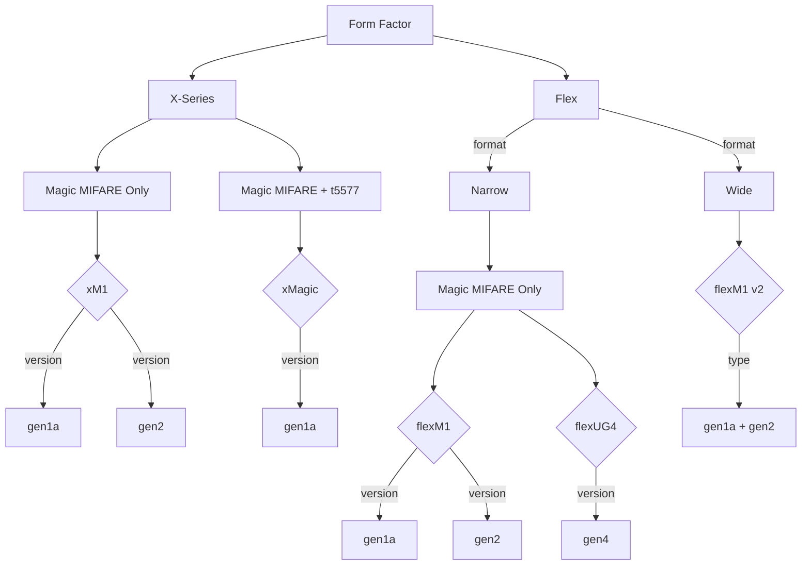

---
MIFARE Classic 1k 4-byte UID Implant Options
---

#### Further Reading
- [Flex Formats](FLEX_FORMATS.md)
- [Magic MIFARE Version Information](MAGIC_MIFARE_VERSIONS.md)
- [t5577 Information](T5577.md)

#### Product Links
- [xM1](https://dngr.us/xm1)
- [xMagic](https://dngr.us/xmagic)
- [flexM1](https://dngr.us/flexm1)
- flexM1 v2 - ***Coming soon!***
- [flexUG4](https://dngr.us/flexug4)

---
[Back to High Frequency Chips](HIGH_FREQUENCY_CHIPS.md)
