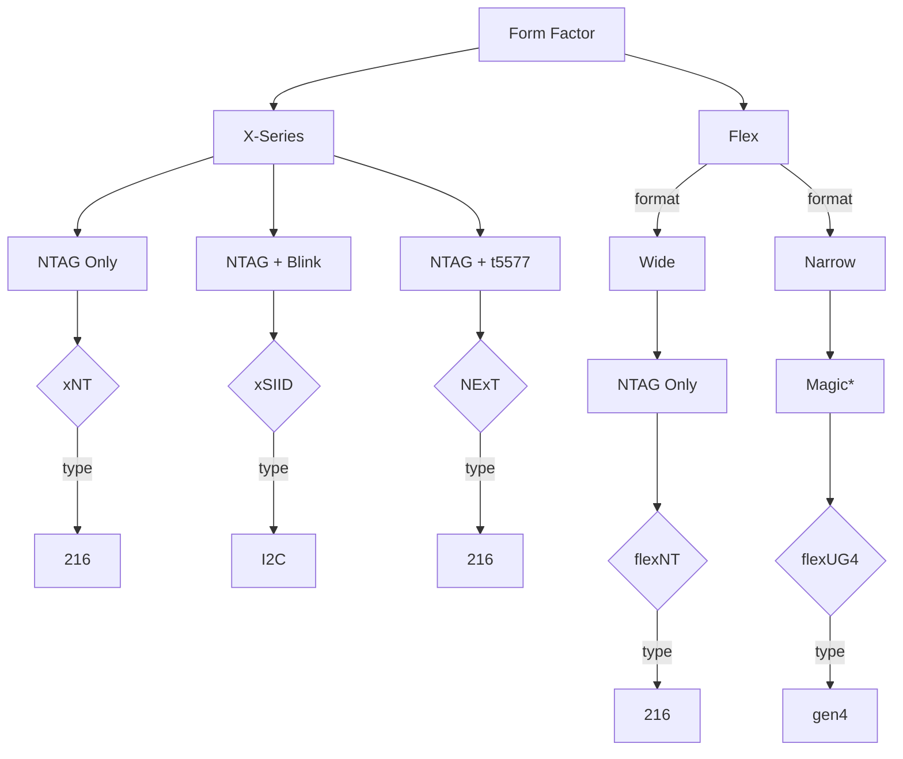

---
NTAG Implant Options
---

\* So called "magic" chips can change their UIDs. Some, like in this case, can also emulate other chips such as the NTAG varieties.

### Further Reading
- [Flex Formats](FLEX_FORMATS.md)
- [NTAG Information](NTAG.md)

### Product Links
- [xNT](https://dngr.us/xnt)
- [xSIID](https://dngr.us/xsiid)
- [flexNT](https://dngr.us/flexnt)
- [flexUG4](https://dngr.us/flexug4)
  
---
### [Back to High Frequency Chips](HIGH_FREQUENCY_CHIPS.md)
