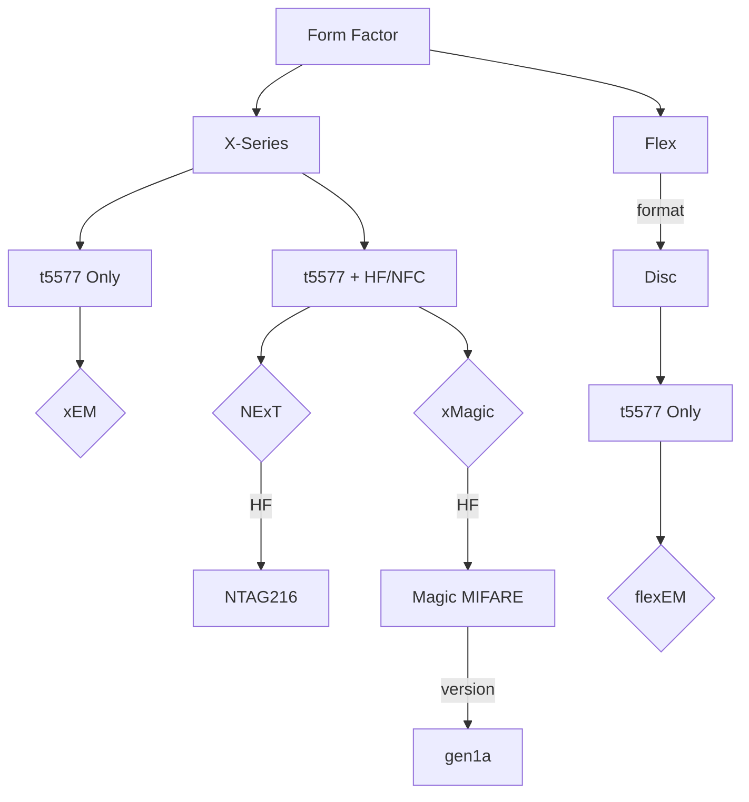

---
T5577 Implant Options
---

#### Further Reading
- [Flex Formats](FLEX_FORMATS.md)
- [NTAG216 Information](NTAG216.md)
- [Magic MIFARE Version Information](MAGIC_MIFARE_VERSIONS.md)
- [t5577 Information](T5577.md)

#### Product Links
- [xEM](dngr.us/xem)
- [NExT](dngr.us/next)
- [xMagic](dngr.us/xmagic)
- [flexEM](dngr.us/flexem)
