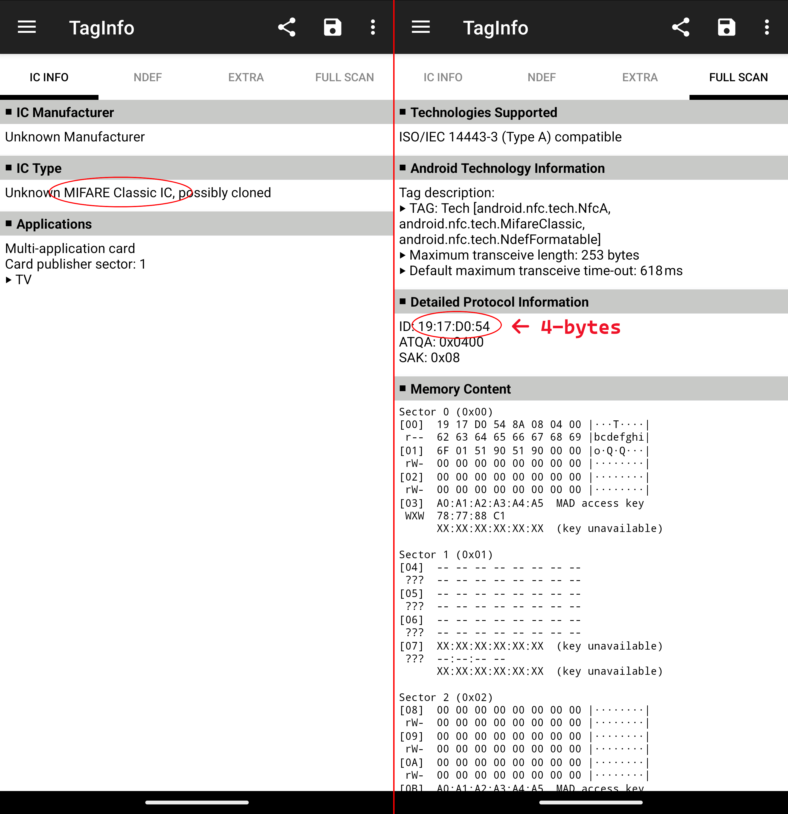
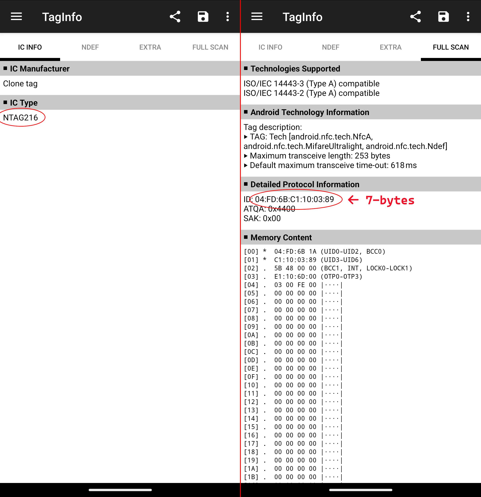
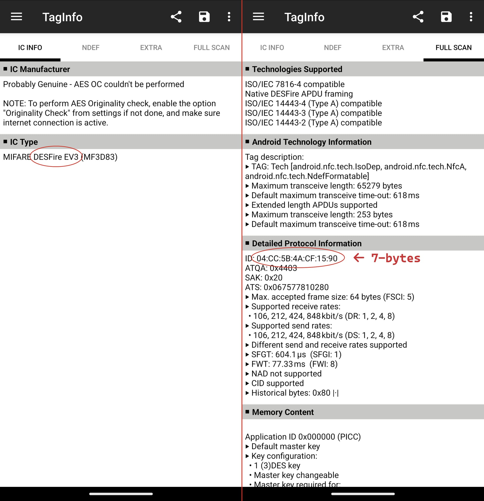

# Identifying Chips

This document is meant to be used in conjunction with [this video]().

When someone has an existing card/badge/FOB/etc that they want an implant to replace, we need to find out what specific chip it is before we can determine if:
1. We have a compatible implant or, if not, can it be converted to an implant
2. Whether their transponder can be cloned or the relevant implant will have to be enrolled in the system

For our purposes, there are two [^overview] main categories of contactless transponders:
- High frequency aka 13.56 MHz aka NFC [^nfc]
- Low frequency aka 125 kHz [^pet] aka RFID [^rfid]

### Overview
- [Using a smartphone](ID_CHIPS.md#smartphone)
- [Using a Proxmark](ID_CHIPS.md#proxmark)
- [Chip Maps](ID_CHIPS.md#next)

---

### Smartphone
A smartphone will quickly tell us whether we're dealing with a high or low frequency transponder quicker than a Proxmark the vast majority of the time. The level of detail it delivers, however, will be less. Even still, it tends to tell us enough about an NFC chip to determine our options.

> [!NOTE]
> You may need to remove your phone's case to scan a transponder.

You'll need NXP's TagInfo:
- [Android](https://play.google.com/store/apps/details?id=com.nxp.taginfolite&pcampaignid=web_share)
- [iPhone](https://apps.apple.com/us/app/nfc-taginfo-by-nxp/)

#### Using TagInfo
- Open the app
- Scan the tag
  - Android phones tend to have a reader along the back. Slowly slide the transponder along the back until it registers then hold it in place.
  - iPhones have their reader along the top.
- If it didn't register, [fire up the Proxmark](ID_CHIPS.md#proxmark).
- Here are some example scans that show what we're interested in:

The "IC Info" tab will load first. The "IC Type" field will tell us what kind of chip it is. With a MIFARE Classic, you'll want to do a "Full Scan" to check the "ID" field. The each byte [^byte] is separated by a colon so we can see it has a 4-byte UID [^uid].

Here we seen an NTAG216. This is the particlar type of NTAG chip we use in our implants but NTAGs come in other varieties such as 210, 212, 215 etc. The shorthand NTAG 21X is common. The big difference between the 21X chips is their storage capacity. We use 216s because they have the largest capacity.

DESFires are expensive secure chips that can run "applications." As such, they have large memory capacities. The most common use our customers have for them is storing photos along with their contact information as an NDEF record. However, if someone is bringing you this, they're most likely interested in using it with a work access control system. DESFire is not clone-able. But, if their access control system's administrators are willing, we do have implants that can be enrolled.

---

### Proxmark

#### Low Frequency

#### High Frequency

---

### Chip Maps:
- [High Frequency](../chips/HIGH_FREQUENCY_CHIPS.md)
- [Low Frequency](../chips/LOW_FREQUENCY_CHIPS.md)

---
### Back to:
- [Home](../README.md)

[^overview]: Technically, there is another: UHF. This operates in the 800-900 MHz range but doesn't place nice with water--which the human body is mostly made of.
[^nfc]: There are so many ways to categorize this. Technically, MIFARE existed before NFC was formalized. It's compliant with some ISO 14443 standards but isn't [NFC Forum](https://nfc-forum.org/) compliant. The Forum is technically the body that formalized NFC.
[^pet]: Pet chips operate at 134 kHz--still low frequency but it is a more niche technology. Our [xBT](https://dngr.us/xbt) is one of these.
[^rfid]: Technically, RFID is an umbrella term that encompasses contactless transponders. You'll find the convention used in the implant world typically refers to 125 kHz transponders.
[^byte]: Each byte is a value composed of two hexadecimal (base 16 numbers; 0-9 and then 10=A, 11=B and so on until we get to F where the next value becomes 10) digits. Each byte can represent 256 values (including 0) so a 4-byte UID can have 2564 or 4,294,967,295 values. 7-bytes gives us a number of values that is 17 digits long in base 10. More than enough. EM410X tags, which are low frequency, have 10-byte UIDs.
[^uid]: NXP is using "ID" here. Technically, it's a "UID" or "Unique ID" because these numbers shouldn't repeat. Although they do for 4-byte versions simply because there aren't enough possibilities for them to be unique at this point.
