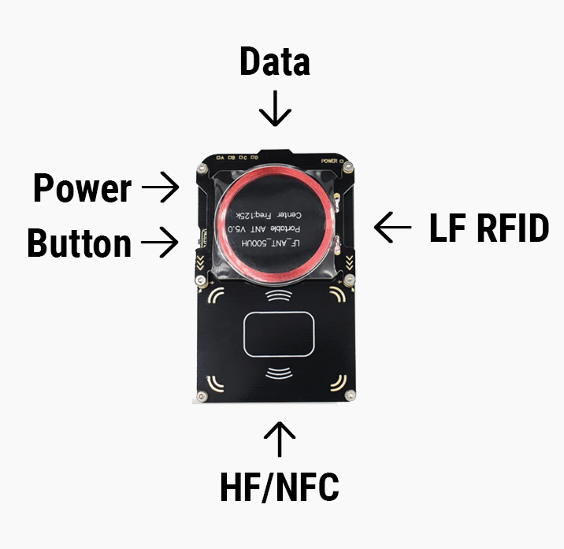

# Proxmark Basics

### x-Series Presentation
Presentation is best when the transponder crosses the antenna at a right angle as seen in the following images using xLEDs and xFDs. Presentation to the middle, empty space won't work.

> [!IMPORTANT]
> The HF antenna is actually on the bottom board. If you're having trouble getting a read, flip it over and aim for the numbers below the barcode.

### Videos

- [Explore and learn the Proxmark Commands](https://youtu.be/q6k4ueWrnec?feature=shared)
- [Cloning MIFARE Classic 1k to an xM1](https://youtu.be/72LwCcDqqss?feature=shared)
- [Cloning common LF transponders to a t5577](https://www.youtube.com/watch?v=F-KPVlyIxrA)

---
### Back to:
- [Home](../README.md)
