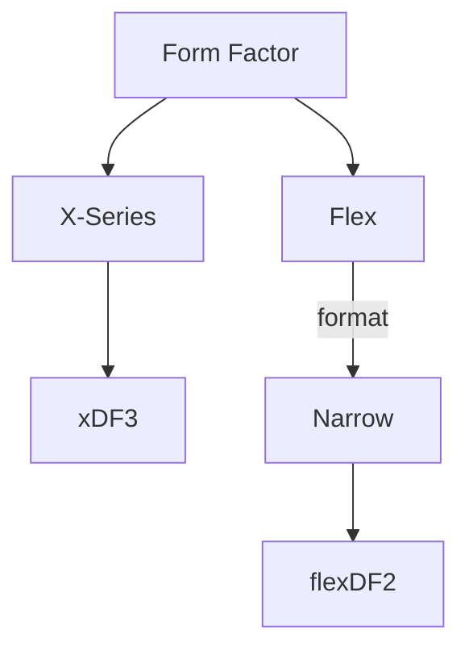

---
DESFire Implant Options
---

----

### Further Reading
- [Flex Formats](FLEX_FORMATS.md)
- [DESFire Information](DESFIRE_INFORMATION.md)

### Product Links
- xDF3 - ***Coming Soon™!***
- [flexDF2](https://dngr.us/flexdf2)

---
### Back to:
- [High Frequency Chips](HIGH_FREQUENCY_CHIPS.md)
- [Home](../README.md)
