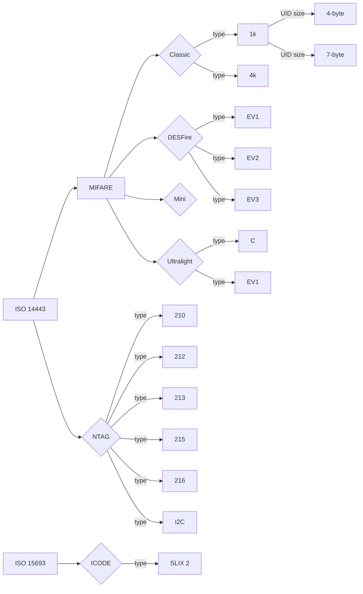

# High Frequency aka 13.56 Mhz aka NFC

---

### Choosing an Implant
- [DESFire](DESFIRE_OPTIONS.md)
- [MIFARE Classic 1k 4-byte UID](MIFARE_CLASSIC_1K_4B_OPTIONS.md)
- [Other Listed MIFARE](https://dngr.us/flexug4)
- [NTAG](NTAG_OPTIONS.md)
- [ICODE SLIX](https://dngr.us/xslx)

---
### Back to:
- [Identifying Chips](../basics/ID_CHIPS.md)
- [Home](../README.md)
