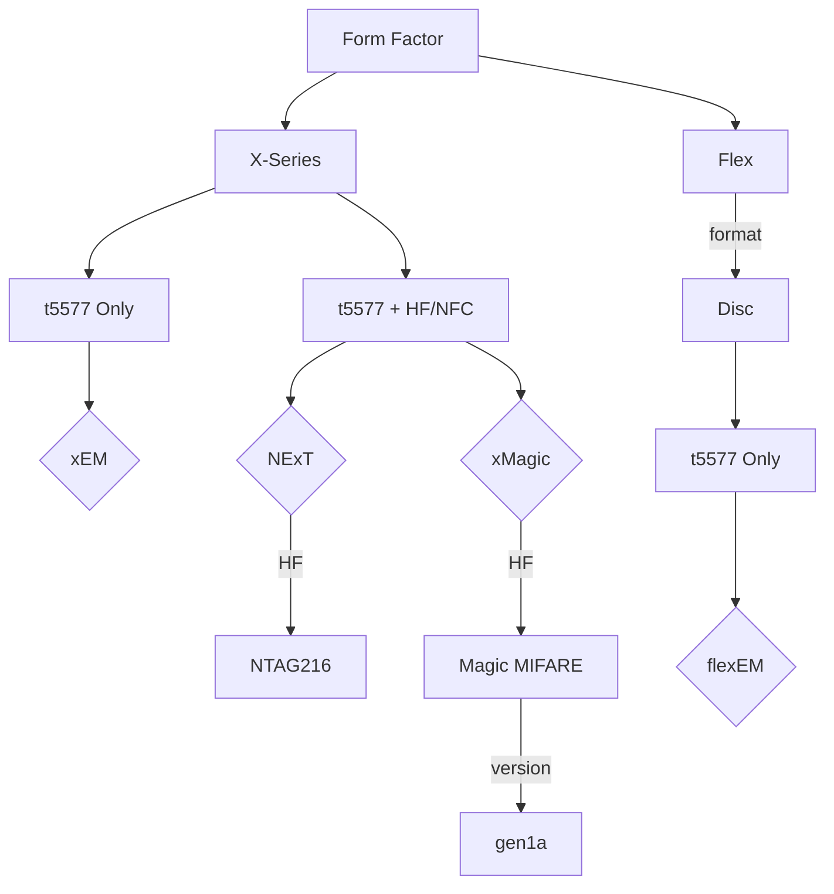

---
T5577 Implant Options
---

---

#### Further Reading
- [Flex Formats](FLEX_FORMATS.md)
- [NTAG Information](NTAG.md)
- [Magic MIFARE Version Information](MAGIC_MIFARE_VERSIONS.md)
- [t5577 Information](T5577.md)

#### Product Links
- [xEM](https://dngr.us/xem)
- [NExT](https://dngr.us/next)
- [xMagic](https://dngr.us/xmagic)
- [flexEM](https://dngr.us/flexem)

---
### Back to:
- [Low Frequency Chips](LOW_FREQUENCY_CHIPS.md)**
- [Home](../README.md)
